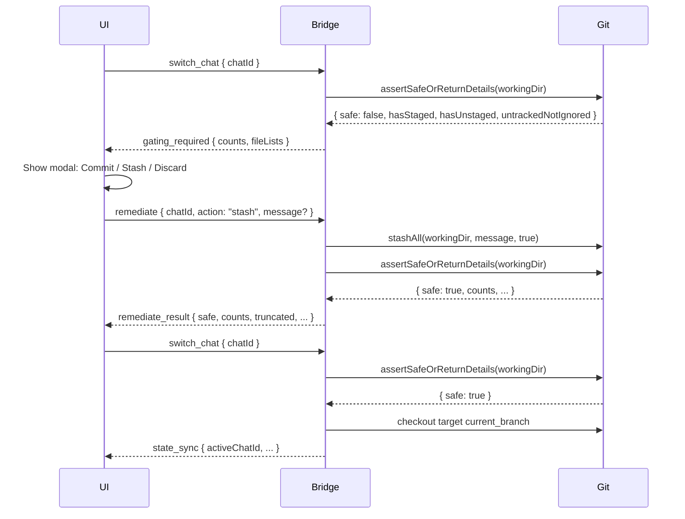

# Chat-Branch Policy (Branch-only Isolation) — Implementation Plan

**Plan version:** 1.4

## Scope and constraints

- **Canon:** [docs/CHAT_BRANCH_POLICY.md](docs/CHAT_BRANCH_POLICY.md).
- **Preserve:** controllerEpoch on all mutating messages; existing session FSM (IDLE/RUNNING/AWAITING_APPROVAL/DISCONNECTED) and reconnect/gap recovery; ALLOWED_ROOTS path safety via [bridge-server/path-validator.js](bridge-server/path-validator.js).
- **Chat == Session** in v1: same persistence and state machine, extended with git/project metadata. PAUSED/ARCHIVED are represented by the explicit **chat_status** column in the sessions table.

---

## Phase 0: Branch, version, changelog (first commits)

1. **Create feature branch** (e.g. `feature/chat-branch-policy`) — do not work on a chat branch.
2. **Bump version:** **Minor bump** 0.16.0 → 0.17.0 (per project decision; this is a feature release). Update [package.json](package.json) and [ui/package.json](ui/package.json) if both are versioned in this monorepo; if only the root is authoritative, bump root only.
3. **Update [CHANGELOG.md](CHANGELOG.md)** (create if missing) at repo root with new version and bullets:
  - Multiple chats per project
  - Chat↔branch mapping (primary/current branch)
  - Safe-state gating on switch chat/branch
  - Auto-checkpoint on idle timeout (commit or stash fallback)
  - Add/select projects via UI (constrained to ALLOWED_ROOTS)

---

## Phase 1: Data model and DB

**File:** [bridge-server/db.js](bridge-server/db.js)

- **Schema versioning:** Add a `schema_version` table (single row, integer). Current version 1; after migrations, set to 2 (or increment per migration).
- **Projects table:**  
`projects(project_path TEXT PRIMARY KEY, created_at INTEGER NOT NULL, last_used_at INTEGER)`
- **Sessions (chats) extension:** Add columns to `sessions` via migration (ALTER TABLE when schema_version < 2):
  - `project_path TEXT` (nullable for backward compat; existing rows can stay NULL)
  - **`chat_status TEXT`** — explicit column, values: `ACTIVE` | `RUNNING` | `PAUSED` | `ARCHIVED` (avoids deriving from state + paused_at/archived_at; used for lease checks and UI).
  - `primary_branch TEXT`, `current_branch TEXT`
  - `last_activity_at INTEGER`, `paused_at INTEGER`, `archived_at INTEGER`
  - `checkpoint_type TEXT`, `checkpoint_ref TEXT`, `checkpoint_at INTEGER`
  - Backfill existing sessions: set chat_status = ACTIVE (or PAUSED if you can infer), and set project_path from existing workingDir if present.
- **audit_log:** Keep `session_id` NOT NULL (no ALTER to nullable; SQLite table rebuild is painful and other code may assume session_id exists). For project-level events (`add_project`, `select_project`), use a **synthetic session id** e.g. `__project__:<projectPath>` or `project:<hash(projectPath)>` so every row still has a session_id. Use `event` + `detail` for the actual event data. **Audit log consumers must treat session_id as an opaque string; do not assume UUID format** (synthetic IDs are not UUIDs).
- **Helpers:**  
`insertProject`, `updateProjectLastUsed`, `listProjects`;  
`updateSessionChatFields` (or extend `insertSession`/new updaters for project_path, chat_status, primary_branch, current_branch, last_activity_at, paused_at, archived_at, checkpoint_*);  
`listChatsByProject(projectPath)`, `getSession(id)` for chat metadata;  
`insertAuditLog` unchanged — call it with the synthetic session_id for project events.

**Migration order:** Create `schema_version` and `projects`; migrate `sessions` (add columns, backfill existing rows if needed). No change to audit_log schema.

---

## Phase 2: Git helper module

**New file:** `bridge-server/git.js`

- **getRepoStatus(workingDir):**  
  - `git rev-parse --is-inside-work-tree` → isGitRepo  
  - `git rev-parse --abbrev-ref HEAD` → currentBranch  
  - `git diff --name-only`, `git diff --cached --name-only` → unstaged/staged file lists; derive hasStaged, hasUnstaged  
  - `git ls-files --others --exclude-standard` → untrackedNotIgnoredFiles  
  - Return shape: `{ hasStaged, hasUnstaged, untrackedNotIgnoredFiles, isGitRepo, currentBranch }`
- **assertSafeOrReturnDetails(workingDir):**  
Safe (v1) = no unstaged tracked changes, no staged changes, no untracked-but-not-ignored files. Return `{ safe: true }` or `{ safe: false, ...getRepoStatus() }` (counts always; file lists for UI). When building gating_required payload, **return counts always; include file lists capped to first N (e.g. 200) and set truncated: true if more exist**, to avoid huge payloads on large diffs.
- **Remediation:**  
  - `commitAll(workingDir, message)` — stage all then commit.  
  - `stashAll(workingDir, message, includeUntracked=true)` — `git stash push -u -m "..."`.  
  - `**discardAll(workingDir)`** — (1) Run `git reset --hard` only. (2) Separately, obtain the untracked-not-ignored file list via `git ls-files --others --exclude-standard` (same as getRepoStatus). (3) Delete only those paths: for each path, resolve to absolute within repo; if it is a directory, recursively delete that directory only with `fs.rmSync(path, { recursive: true, force: true })`; if file, unlink. **All deletions must be restricted to paths within the repo root** (reject or resolve any path that would escape). Do **not** use `git clean -fd` (it would remove ignored files). Document danger.
- **Risky checkpoint detection:**  
Sensitive patterns (e.g. `.env`, `*.pem`, `*.key`, `id_rsa`, credentials); max file count (200). If risky or commit fails → fallback to stash -u. Implement in a function used by checkpoint logic.

Use `child_process.spawnSync` or `execSync` with no shell (per AGENTS.md). Run git from `workingDir` (cwd).

---

## Phase 3: Project management (WS + validation)

**Path validation for add_project:**  
User sends a path (e.g. absolute). Server must:

1. **Require the exact directory to exist:** `fs.statSync(path)` or equivalent; must be a directory. If the path does not exist or is not a directory → return `PATH_NOT_FOUND`. **Do not use ancestor walk** for add_project (ancestor walk is for validating tool-call paths; adding a non-existent or parent path as a project would be confusing).
2. Resolve the path with `fs.realpathSync(path)` (path exists, so realpath is defined).
3. Ensure resolved path is under one of `resolvedRoots` (prefix containment: `resolved === root || resolved.startsWith(root + path.sep)`). If not → `NOT_WITHIN_ALLOWED_ROOTS`.
4. Ensure it is a git repo: `git rev-parse --is-inside-work-tree` in that directory. If not → `NOT_A_GIT_REPO`.

Add a helper e.g. `validateProjectPath(rawPath, resolvedRoots)` that returns `{ safe, resolvedPath }` or `{ safe: false, error: 'PATH_NOT_FOUND' | 'NOT_WITHIN_ALLOWED_ROOTS' | 'NOT_A_GIT_REPO' }`.

**WS messages (bridge [index.js](bridge-server/index.js)):**

- **list_projects** — no payload. Handler: read from DB `listProjects()`, respond (e.g. via state_sync or dedicated `projects_list`).
- **add_project** — payload `{ projectPath }`. Validate path (directory exists, allowed root, git repo); insert into `projects`; update state_sync; respond with success or structured error (subtype for UI).
- **select_project** — payload `{ projectPath }`. Sets `activeProjectPath` on the server (store in session manager or connection state); update `last_used_at` for that project in DB; send state_sync with `activeProjectPath` and chats for that project. Audit event `select_project`. **select_project updates UI context only; it must not change git branch.** Only switch_chat / switch_branch perform checkout.
- **remove_project** — optional v1; omit if it adds complexity (per spec).

**controllerEpoch:** Epoch-gate **only mutating** messages so a stale second tab can still read data. **Require epoch validation for:** add_project, select_project, create_chat, switch_chat, switch_branch, archive_chat, remediate (and remove_project if implemented). **Do not epoch-gate:** list_projects, list_chats — leave them ungated so opening a second tab still shows projects/chats without “stale epoch” close. This aligns with “stale tab can’t mutate” intent.

**state_sync extension:** Include `projects[]` (from DB) and `activeProjectPath` (set by select_project or when creating/switching to a chat in a project). When the client connects, after add_project, or after select_project, send state_sync with these so the UI can show project list and selection.

---

## Phase 4: Chat lifecycle and idle timeout

- **PAUSED / ARCHIVED:** Use the explicit **chat_status** column (ACTIVE | RUNNING | PAUSED | ARCHIVED); keep `paused_at` / `archived_at` for timestamps. Keep existing `state` for execution (IDLE/RUNNING/AWAITING_APPROVAL/DISCONNECTED). When loading a PAUSED chat, still use IDLE for “ready to run” and only RUNNING/AWAITING_APPROVAL when claude is active.

- **chat_status vs state (source of truth):** **chat_status** is the UI/lifecycle status, written by the bridge server. **state** is the execution status, written by the existing session engine. To avoid drift, apply these **update rules** whenever the corresponding event occurs:
  - On chat creation: **chat_status = ACTIVE**
  - When session starts agent work (claude run): **chat_status = RUNNING**
  - When agent work ends (claude exits): **chat_status = ACTIVE** (unless chat is already PAUSED or ARCHIVED — do not overwrite)
  - On idle timeout checkpoint: **chat_status = PAUSED**
  - On user resumes or selects a PAUSED chat: **chat_status = ACTIVE**
  - On archive_chat: **chat_status = ARCHIVED** (terminal; do not overwrite)
  - **DISCONNECTED** (transport-level) does **not** change chat_status; only state changes for reconnect handling.

- **last_activity_at:** Update on input, approval_response, and any activity that indicates “user is here.” Used for idle timeout.
- **Idle timeout (12 hours):** Timer (or periodic check) keyed off `last_activity_at`. When elapsed for an ACTIVE chat:
  - **Only run checkpoint when session execution state is IDLE** (not RUNNING, not AWAITING_APPROVAL, not DISCONNECTED). If the chat is RUNNING or AWAITING_APPROVAL, do not checkpoint — postpone until the chat returns to IDLE (or skip this cycle). This avoids racing with in-flight claude work.
  1. Run **checkpoint(chatId):**
    - If repo safe → no-op.  
    - Else try auto-commit on current_branch; if risky or commit fails → stash -u.  
    - Persist checkpoint_type, checkpoint_ref, checkpoint_at on session; write audit_log.
  2. Mark chat PAUSED: set **chat_status = PAUSED**, paused_at = now, state = IDLE (so UI can show PAUSED).
- **checkpoint(chatId)** implementation: Resolve session’s working dir (project_path); call getRepoStatus; if safe skip; else detect risky; attempt commit or stash; update DB and audit_log.

---

## Phase 5: Multi-chat protocol and gating

**WS messages:**

- **list_chats** — payload `{ projectPath }`. Return chats for that project (from DB: sessions where project_path = projectPath, with metadata).
- **create_chat** — payload `{ projectPath, name }`.  
  - **Must be gated by Safe State:** Before creating a branch or changing the repo, call `assertSafeOrReturnDetails(projectPath)` — **always pass the explicit projectPath** for create_chat (do not use “current” project; the repo being gated is the one where the new chat will live). If not safe, return **gating_required** (same shape as switch_chat).  
  - After safe (or after remediation): Validate projectPath (allowed + git repo). Base branch = **current HEAD** in projectPath (intentional: “branch from where I am now”); record this base branch in audit_log when creating the chat. Primary branch name: `chat/YYYYMMDD/<shortId>-<slug>` (shortId from new session UUID, slug from name). Run `git checkout -b <primaryBranch>` in projectPath. Create session (chat) with project_path, primary_branch, current_branch = primaryBranch; persist; audit_log.
- **switch_chat** — payload `{ chatId }`.  
  - **Lease (v1, from DB):** A branch is “leased” if some chat in the same project has **chat_status** (explicit column) in (ACTIVE, RUNNING) and current_branch matches. Use the `chat_status` column in the sessions table; no in-memory lease map. If target chat’s `current_branch` is already leased by another chat with chat_status ACTIVE or RUNNING, deny with e.g. `branch_in_use`.  
  - **Safe-state repo:** Run safe-state check against **the repo for the action**: for switch_chat use **target chat’s project_path** (and ensure it matches activeProjectPath, or require the user to select that project first). If not safe → return **gating_required**.  
  - After remediation: checkout target chat’s current_branch; set active chat; send state_sync.
- **archive_chat** — payload `{ chatId }`. Set archived_at; release “lease”; audit_log.
- **switch_branch** — payload `{ branchName }`. Same gating: safe state (against active project’s repo) + lease check (deny if that branch is leased by another ACTIVE/RUNNING chat in the same project). **Branch existence (v1, deterministic):** If local `refs/heads/<branchName>` exists → checkout. Else if `refs/remotes/origin/<branchName>` exists → create local tracking branch automatically (`git checkout -b <name> --track origin/<name>`). Else return `BRANCH_NOT_FOUND`. No auto-fetch in v1. **branchName** may contain slashes (e.g. `feature/x`); treat it only as a branch name, never as a filesystem path. **Detached HEAD:** If current branch resolves to `HEAD` (e.g. `git rev-parse --abbrev-ref HEAD` returns `HEAD`), treat as detached; either block branch-switch until user checks out a branch, or allow checkout and then proceed (minimal v1: allow checkout). Then update chat’s current_branch; audit_log.

**Safe-state checks:** Always run against the repo for the action: **projectPath** for create_chat (and create/list for that project); **targetChat.project_path** for switch_chat; active project’s repo for switch_branch. Never accidentally gate using “current” project if it differs from the action’s repo.

**Gating flow:**  
When server receives switch_chat or switch_branch, call `assertSafeOrReturnDetails(workingDir)` with the correct workingDir for that action. If not safe, respond with **gating_required**: return **counts always** (staged, unstaged, untracked-not-ignored); **cap file lists** to first N (e.g. 200) and set `truncated: true` if more exist, so large diffs don’t blow up the payload. UI shows modal (Commit/Stash/Discard).

**remediate message (v1):** `remediate { chatId, action: 'commit'|'stash'|'discard', message? }`. Server derives workingDir from chatId → chat.project_path, validates that the repo exists and is within ALLOWED_ROOTS, then runs git.js remediation (commitAll/stashAll/discardAll) on that repo. **Server must never use implicit “current working directory” for remediation.** After remediate runs, **server re-runs assertSafeOrReturnDetails and returns the result** as e.g. **remediate_result { safe, counts, truncated, ... }** (commitAll can fail — nothing to commit, conflicts — so the UI needs the post-remediate state). UI retries switch_chat or switch_branch only if `safe === true`.

**state_sync extension:** Add `activeChatId`, list of chats for current project (with metadata: id, name, chat_status, primary_branch, current_branch, paused_at, archived_at), and per-chat git fields where relevant. Include `currentBranch` in state_sync so header can show it.

---

## Phase 6: create_session → create_chat alignment

- **Backward compatibility:** Existing flow uses `create_session` with workingDir. For v1, either:
  - Keep create_session and treat it as “create default chat for this project” (one project, one chat if no multi-chat UI), or
  - Introduce create_chat as the primary path and have create_session call into the same “create chat” logic when project has no chats.
- Recommended: **create_chat** is the canonical path; **create_session** remains for backward compat and becomes “create a chat for the given project” (same DB and branch creation as create_chat). So: when UI sends create_session with workingDir, bridge creates a session with project_path = workingDir, creates primary branch, etc. When UI uses “Create chat” in project, it sends create_chat. Unify internal “create chat” logic so both paths use it.

---

## Phase 7: UI

**Files:** [ui/app/page.tsx](ui/app/page.tsx), [ui/lib/protocol.ts](ui/lib/protocol.ts), new components as needed.

- **Protocol:** Extend [ui/lib/protocol.ts](ui/lib/protocol.ts): StateSyncPayload with `projects`, `activeProjectPath`, `activeChatId`, `chats` (array of chat meta), `currentBranch`; add Zod schemas and types for list_projects, add_project, select_project, list_chats, create_chat, switch_chat, archive_chat, switch_branch, gating_required, remediate.
- **Project selector:** List projects (from state_sync); “Add project” opens a simple path input dialog (no OS folder picker in v1). On choosing a project, UI sends select_project { projectPath } so the server sets activeProjectPath and returns state_sync with chats for that project; then show chats and allow create/switch/archive.
- **Chat selector:** For selected project, list chats; create chat; switch chat; archive chat. Display currentBranch in header.
- **Gating modal:** When switch_chat or switch_branch returns gating_required, show modal with staged/unstaged/untracked-not-ignored summary (counts + capped file list) and buttons: Commit, Stash, Discard. On Commit/Stash, optional message input. **Discard requires a second confirmation in the UI** (e.g. “Are you sure? This cannot be undone.”). Send remediate { chatId, action, message? } then retry switch.
- **Token/config:** [ui/app/api/token/route.ts](ui/app/api/token/route.ts) already returns allowedRoots; UI continues to use it. Projects list is from bridge (state_sync / list_projects), not from env.

---

## Phase 8: Logging and audit

- **audit_log events:** create_chat, switch_chat, switch_branch, checkpoint_commit, checkpoint_stash, archive_chat, discard_changes, add_project, select_project. Use existing `insertAuditLog(sessionId, rootMessageId, event, detail)`; for project events use a **synthetic session_id** (e.g. `__project__:<projectPath>`) so session_id remains NOT NULL.
- **Transcript system line:** Optionally add a transcript “system” line when checkpoint runs (commit or stash) so it appears in chat history.

---

## Phase 9: Tests

- **Unit tests (bridge-server/test/):**
  - **git.test.js:** getRepoStatus and assertSafeOrReturnDetails with mocked git (spawnSync/execSync mocked or use temp dir with real git). Safe when clean; unsafe when staged/unstaged/untracked; remediation stubs or integration-style.
  - **add_project validation:** Path validation: directory must exist (fs.stat); realpath; allowed-roots containment; git repo. Tests for PATH_NOT_FOUND (missing path or not a directory), NOT_WITHIN_ALLOWED_ROOTS, NOT_A_GIT_REPO. No ancestor walk for add_project.
  - **db.test.js:** Extend for projects table and new session columns; listChatsByProject, etc.
- **Integration-style:** One test that simulates a dirty repo and verifies switch_chat (or switch_branch) returns gating_required payload (e.g. create session, run git to make dirty, call switch_chat, assert response type and counts).

---

## Phase 10: Docs and procedures

- **[docs/IMPLEMENTATION_LOG.md](docs/IMPLEMENTATION_LOG.md):** New section describing Chat-Branch Policy implementation: DB schema, git.js, project/chats WS messages, gating flow, idle timeout, UI changes.
- **[docs/TEST_PROCEDURES.md](docs/TEST_PROCEDURES.md):** Add manual tests: add/select project; chat/branch gating (make dirty, switch chat, see modal; stash, retry, succeed); idle timeout checkpoint (wait or mock 12h, verify checkpoint commit or stash).
- **[docs/CHAT_BRANCH_POLICY.md](docs/CHAT_BRANCH_POLICY.md):** Already canonical; update status if needed (e.g. “Implemented in v0.17”).

---

## Implementation order (small commits)

| Order | Focus                                                | Commit scope                                                                                                                |
| ----- | ---------------------------------------------------- | --------------------------------------------------------------------------------------------------------------------------- |
| 1     | Branch + version + CHANGELOG                         | Feature branch, package.json x2, new CHANGELOG.md                                                                           |
| 2     | DB schema + migrations                               | db.js: schema_version, projects, sessions ALTER, helpers (audit_log unchanged; use synthetic session_id for project events) |
| 3     | git.js                                               | New git.js: getRepoStatus, assertSafeOrReturnDetails, commitAll, stashAll, discardAll, risky detection                      |
| 4     | Project path validation                              | path-validator or new helper for add_project (allowed root + git repo)                                                      |
| 5     | list_projects / add_project WS                       | index.js handlers, state_sync projects + activeProjectPath                                                                  |
| 6     | create_chat + branch creation                        | create_chat handler, primary branch naming, git checkout -b, DB + audit                                                     |
| 7     | list_chats, switch_chat, archive_chat, switch_branch | Handlers + gating (assertSafeOrReturnDetails), gating_required response, remediate message                                  |
| 8     | Idle timeout + checkpoint                            | Timer/check, checkpoint(), PAUSED transition, audit + transcript line                                                       |
| 9     | UI: protocol + project selector + add project        | protocol.ts, page.tsx project list and add-project path dialog                                                              |
| 10    | UI: chat selector + gating modal                     | Chat list, create/switch/archive, gating modal (Commit/Stash/Discard), currentBranch in header                              |
| 11    | Tests                                                | git.test.js, add_project validation test, db extensions, integration gating test                                            |
| 12    | Docs                                                 | IMPLEMENTATION_LOG.md, TEST_PROCEDURES.md, CHAT_BRANCH_POLICY status                                                        |

---

## Key files to touch

- **Bridge:** [bridge-server/db.js](bridge-server/db.js), [bridge-server/index.js](bridge-server/index.js), [bridge-server/session.js](bridge-server/session.js), [bridge-server/path-validator.js](bridge-server/path-validator.js); new [bridge-server/git.js](bridge-server/git.js).
- **UI:** [ui/app/page.tsx](ui/app/page.tsx), [ui/lib/protocol.ts](ui/lib/protocol.ts); new modal component(s) for gating and add-project.
- **Docs:** [docs/IMPLEMENTATION_LOG.md](docs/IMPLEMENTATION_LOG.md), [docs/TEST_PROCEDURES.md](docs/TEST_PROCEDURES.md), [docs/CHAT_BRANCH_POLICY.md](docs/CHAT_BRANCH_POLICY.md).
- **Stub:** [bridge-server/stub.js](bridge-server/stub.js) — add handlers for new message types so UI dev against stub still works.

---

## Diagram: Gating flow

---

## Optional v1 omissions (per spec)

- **remove_project:** Omit if it adds complexity.
- **OS folder picker:** Use simple path input for Add Project only.

---

## Changelog (plan document)

- **1.4** — **chat_status update rules:** source-of-truth rule (chat_status = UI/lifecycle, state = execution); explicit update rules on create (ACTIVE), start agent (RUNNING), end agent (ACTIVE unless PAUSED/ARCHIVED), idle timeout (PAUSED), resume/select PAUSED (ACTIVE), archive (ARCHIVED terminal); DISCONNECTED does not change chat_status. Mermaid: remediate response is remediate_result { safe, counts, truncated, ... } after post-remediate recheck. switch_branch: branchName may contain slashes (e.g. feature/x); treat as branch name only, not path.

- **1.3** — Explicit **chat_status** column in sessions (ACTIVE | RUNNING | PAUSED | ARCHIVED); lease checks use this column. Mermaid: remediate includes chatId. switch_branch: deterministic branch existence (local → checkout; else origin/<name> → create tracking branch; else BRANCH_NOT_FOUND); detached HEAD handling (allow checkout or block until on branch). After remediate: server re-runs assertSafeOrReturnDetails and returns updated status; UI retries switch only if safe.

- **1.2** — remediate scoped by chatId (or projectPath): payload `remediate { chatId, action, message? }`; server derives workingDir from chat.project_path, validates repo; never use implicit “current” repo. switch_branch: verify local branch exists (git show-ref refs/heads/<name>); return BRANCH_NOT_FOUND if missing; no auto-fetch in v1; optional tracking branch from origin. gating_required: counts always; file lists capped (e.g. 200) + truncated: true. UI: discard requires second confirmation.

- **1.1** — controllerEpoch: epoch-gate only mutating (add_project, select_project, create_chat, switch_chat, switch_branch, archive_chat, remediate); leave list_projects/list_chats ungated. Safe-state repo: explicit projectPath for create_chat; targetChat.project_path for switch_chat; note “repo for the action.” Audit: session_id is opaque (no UUID assumption). Lease: derive from DB (ACTIVE/RUNNING + current_branch + archived_at null); apply to switch_branch. discardAll: if directory in list, fs.rmSync recursive; all deletions restricted to repo root. select_project: must not change git branch. Version bump note: root vs ui package.json per monorepo convention.

- **1.0** — Initial plan: phases 0–10, DB/git/project/chat protocol, gating flow, idle timeout, UI, tests, docs. Post-review updates: minor version bump, CHANGELOG create-if-missing, audit_log synthetic session_id, create_chat safe-state gating, base branch in audit_log, discardAll spec (reset + unlink list only), idle checkpoint only when IDLE, select_project message, add_project path must exist (no ancestor walk), v1 lease denial on switch_chat/switch_branch.
